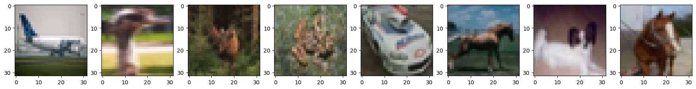
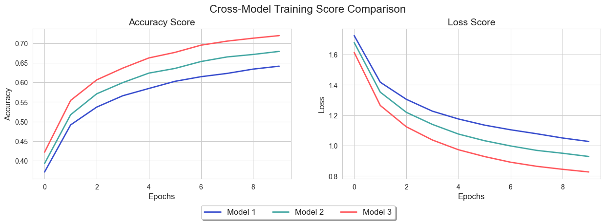
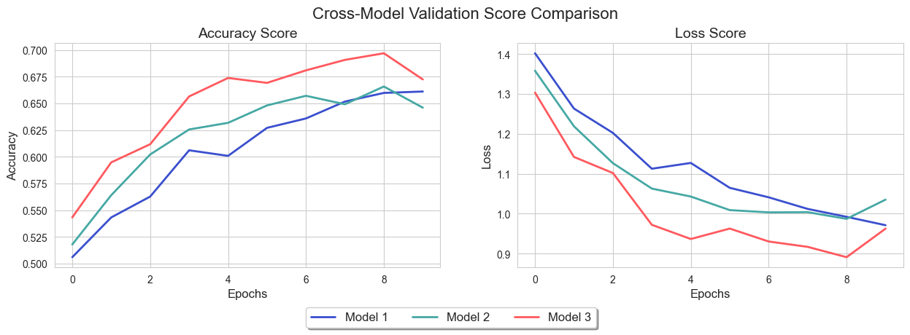
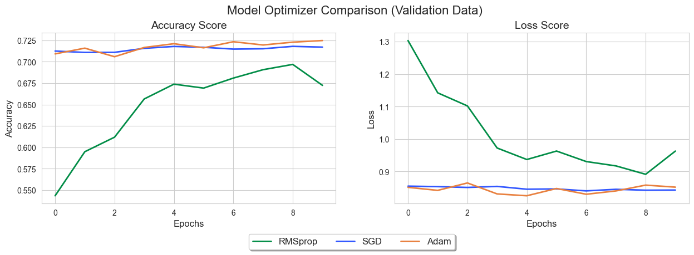

##### Tuesday the 17th of September, 2024
# A CNN for Image Classification With Conv2D and MaxPooling2D

## Introduction
### Background

The current state of image classification models is fueled by advancements in deep learning (e.g., convolutional neural networks (CNNs)) which have set new performance benchmarks. Pretrained models and transfer learning allow companies to leverage large-scale models without needing vast labeled datasets, while self-supervised learning further reduces the dependence on annotations. Consequently, their use has quickly grown and spread into a number of industries including manufacturing, healthcare, retail, and security.

For companies, image classification offers significant value by automating visual tasks, reducing costs, improving accuracy, and enhancing customer experiences. By integrating image classification, companies can scale operations, improve personalization, and innovate in areas like autonomous vehicles and smart technologies, ultimately boosting their competitiveness and growth.

### Objective

The goal of this project is to develop an effective image classification model using a Conv2D and MaxPooling2D-based convolutional neural network.

## Dataset description

In this project, we will use the [CIFAR-10](https://www.cs.toronto.edu/~kriz/cifar.html) dataset—a well-known data collection for image classification, constituting 60,000 32x32 color images in 10 classes, with 6,000 images per class. The dataset contains a total of 50,000 training images and 10,000 test images.

The image classes are as follows:
1. Airplane
2. Automobile
3. Bird
4. Cat
5. Deer
6. Dog
7. Frog
8. Horse
9. Ship
10. Truck

## Import Python Modules

The following libraries/modules will be used in this project:

- Pandas
- Matplotlib
- Seaborn
- TensorFlow
- random

---
## Load the Data

We begin by loading the dataset using the `cifar10` module. Let's have a look at a few example images from the dataset. We will use the `random.randint()` function to randomly return 8 of the 50,000 training images.

    

Although pixelated, we can with relative certainty, discern that the images above depict a plane, a bird, a frog, a frog, an automobile, a horse, a dog, and a horse. 

---
## Data Preprocessing

Our simple data preprocessing consists of firstly changing the image classes from integers ranging from 0-9 to vectors with a 1 in the Xth position. Then, we change the training and test dataframe data types to float and scale our data so that each entry occupies a single byte of memory.

## Model Development
We will develop, train, and test three CNN models—each with increasing depth. Each model's performance will then be compared and discussed.

### First Model
Below we will build our initial CNN model. As it is our first model, it is the least deep of the three models. The model begins with two 5x5 Conv2D layers with strides of 2 and 32 filters each, followed by a MaxPooling layer. Finally, the model is flattened, followed by a single fully-connected layer and then the final classification layer. The structure can be summarized as follows:

*Conv2D → Conv2D → MaxPooling → Flatten → Dense → Final Classification*

<pre style="white-space:pre;overflow-x:auto;line-height:normal;font-family:Menlo,'DejaVu Sans Mono',consolas,'Courier New',monospace">┏━━━━━━━━━━━━━━━━━━━━━━━━━━━━━━━━━┳━━━━━━━━━━━━━━━━━━━━━━━━┳━━━━━━━━━━━━━━━┓
┃ Layer (type)                    ┃ Output Shape           ┃       Param # ┃
┡━━━━━━━━━━━━━━━━━━━━━━━━━━━━━━━━━╇━━━━━━━━━━━━━━━━━━━━━━━━╇━━━━━━━━━━━━━━━┩
│ conv2d (Conv2D)                 │ (None, 16, 16, 32)     │         2,432 │
├─────────────────────────────────┼────────────────────────┼───────────────┤
│ conv2d_1 (Conv2D)               │ (None, 8, 8, 32)       │        25,632 │
├─────────────────────────────────┼────────────────────────┼───────────────┤
│ max_pooling2d (MaxPooling2D)    │ (None, 4, 4, 32)       │             0 │
├─────────────────────────────────┼────────────────────────┼───────────────┤
│ dropout (Dropout)               │ (None, 4, 4, 32)       │             0 │
├─────────────────────────────────┼────────────────────────┼───────────────┤
│ flatten (Flatten)               │ (None, 512)            │             0 │
├─────────────────────────────────┼────────────────────────┼───────────────┤
│ dense (Dense)                   │ (None, 512)            │       262,656 │
├─────────────────────────────────┼────────────────────────┼───────────────┤
│ dropout_1 (Dropout)             │ (None, 512)            │             0 │
├─────────────────────────────────┼────────────────────────┼───────────────┤
│ dense_1 (Dense)                 │ (None, 10)             │         5,130 │
└─────────────────────────────────┴────────────────────────┴───────────────┘
</pre>

<pre style="white-space:pre;overflow-x:auto;line-height:normal;font-family:Menlo,'DejaVu Sans Mono',consolas,'Courier New',monospace"> Total params: 295,850 (1.13 MB)
</pre>

### Second Model
Next, we will build our second CNN model. We will follow the same general structure as the initial model; however, the second Conv2D layer will now have 64 filters, increasing the depth of the model.

<pre style="white-space:pre;overflow-x:auto;line-height:normal;font-family:Menlo,'DejaVu Sans Mono',consolas,'Courier New',monospace">┏━━━━━━━━━━━━━━━━━━━━━━━━━━━━━━━━━┳━━━━━━━━━━━━━━━━━━━━━━━━┳━━━━━━━━━━━━━━━┓
┃ Layer (type)                    ┃ Output Shape           ┃       Param # ┃
┡━━━━━━━━━━━━━━━━━━━━━━━━━━━━━━━━━╇━━━━━━━━━━━━━━━━━━━━━━━━╇━━━━━━━━━━━━━━━┩
│ conv2d_2 (Conv2D)               │ (None, 16, 16, 32)     │         2,432 │
├─────────────────────────────────┼────────────────────────┼───────────────┤
│ conv2d_3 (Conv2D)               │ (None, 8, 8, 64)       │        51,264 │
├─────────────────────────────────┼────────────────────────┼───────────────┤
│ max_pooling2d_1 (MaxPooling2D)  │ (None, 4, 4, 64)       │             0 │
├─────────────────────────────────┼────────────────────────┼───────────────┤
│ dropout_2 (Dropout)             │ (None, 4, 4, 64)       │             0 │
├─────────────────────────────────┼────────────────────────┼───────────────┤
│ flatten_1 (Flatten)             │ (None, 1024)           │             0 │
├─────────────────────────────────┼────────────────────────┼───────────────┤
│ dense_2 (Dense)                 │ (None, 512)            │       524,800 │
├─────────────────────────────────┼────────────────────────┼───────────────┤
│ dropout_3 (Dropout)             │ (None, 512)            │             0 │
├─────────────────────────────────┼────────────────────────┼───────────────┤
│ dense_3 (Dense)                 │ (None, 10)             │         5,130 │
└─────────────────────────────────┴────────────────────────┴───────────────┘
</pre>

<pre style="white-space:pre;overflow-x:auto;line-height:normal;font-family:Menlo,'DejaVu Sans Mono',consolas,'Courier New',monospace"> Total params: 583,626 (2.23 MB)
</pre>

### Third Model
Our third and final model will have the same structure as the first and second; however, this time the second Conv2D layer will have 128 filters:

<pre style="white-space:pre;overflow-x:auto;line-height:normal;font-family:Menlo,'DejaVu Sans Mono',consolas,'Courier New',monospace">┏━━━━━━━━━━━━━━━━━━━━━━━━━━━━━━━━━┳━━━━━━━━━━━━━━━━━━━━━━━━┳━━━━━━━━━━━━━━━┓
┃ Layer (type)                    ┃ Output Shape           ┃       Param # ┃
┡━━━━━━━━━━━━━━━━━━━━━━━━━━━━━━━━━╇━━━━━━━━━━━━━━━━━━━━━━━━╇━━━━━━━━━━━━━━━┩
│ conv2d_4 (Conv2D)               │ (None, 16, 16, 32)     │         2,432 │
├─────────────────────────────────┼────────────────────────┼───────────────┤
│ conv2d_5 (Conv2D)               │ (None, 8, 8, 128)      │       102,528 │
├─────────────────────────────────┼────────────────────────┼───────────────┤
│ max_pooling2d_2 (MaxPooling2D)  │ (None, 4, 4, 128)      │             0 │
├─────────────────────────────────┼────────────────────────┼───────────────┤
│ dropout_4 (Dropout)             │ (None, 4, 4, 128)      │             0 │
├─────────────────────────────────┼────────────────────────┼───────────────┤
│ flatten_2 (Flatten)             │ (None, 2048)           │             0 │
├─────────────────────────────────┼────────────────────────┼───────────────┤
│ dense_4 (Dense)                 │ (None, 512)            │     1,049,088 │
├─────────────────────────────────┼────────────────────────┼───────────────┤
│ dropout_5 (Dropout)             │ (None, 512)            │             0 │
├─────────────────────────────────┼────────────────────────┼───────────────┤
│ dense_5 (Dense)                 │ (None, 10)             │         5,130 │
└─────────────────────────────────┴────────────────────────┴───────────────┘
</pre>

<pre style="white-space:pre;overflow-x:auto;line-height:normal;font-family:Menlo,'DejaVu Sans Mono',consolas,'Courier New',monospace"> Total params: 1,159,178 (4.42 MB)
</pre>

## Model Performance 

We defined a function to calculate the best values of accuracy and loss for all three models, on both the training data and the validation data. The results are shown in the table below.

<table border="1" class="dataframe">
  <thead>
    <tr style="text-align: right;">
      <th></th>
      <th>Model</th>
      <th>Training Accuracy</th>
      <th>Training Loss</th>
      <th>Validation Accuracy</th>
      <th>Validation Loss</th>
    </tr>
  </thead>
  <tbody>
    <tr>
      <th>0</th>
      <td>M1</td>
      <td>0.64122</td>
      <td>1.027263</td>
      <td>0.6611</td>
      <td>0.971241</td>
    </tr>
    <tr>
      <th>1</th>
      <td>M2</td>
      <td>0.67896</td>
      <td>0.928378</td>
      <td>0.6658</td>
      <td>0.987152</td>
    </tr>
    <tr>
      <th>2</th>
      <td>M3</td>
      <td>0.71922</td>
      <td>0.826540</td>
      <td>0.6969</td>
      <td>0.891188</td>
    </tr>
  </tbody>
</table>

### Training Score Comparison

    

### Validation Score Comparison

    

## Optimizer comparison

We compare the performance of the third model `M3` with three different optimizers. The first being the RMSprop optimizer that we used already, and the other two being Stochastic Gradient Descent (SGD) and Adam.

    

    

It is evident in the figure above that the RMSprop optimizer yields the lowest performance in terms of accuracy and loss; however, the SGD and Adam optimizers are comparable with the Adam optimizer only slightly outperforming SGD. 

## Discussion

The three models we compared all share the same general structure; only differing in their depth by changing the number of filters in the second Conv2D layer. Therefore, we can effectively assess the effect of increasing model depth with the results yielded. Depth and accuracy score increases from models `M1` → `M2` → `M3`, while loss score decreases. As such, we can conclude that within the range of parameters compared, model performance increases with increasing depth. 

As all models are equal in terms of their explainability, the final recommended model from this comparison is `M3`, trained with the Adam optimizer. Hyperparameter tuning is still necessary to improve this model, as the model scores suggest the that `M3` is the most overfit of the three models compared. It would also be ideal to experiment with different clsutering techniques and model structures entirely, as it is possible they yield improved results. 
